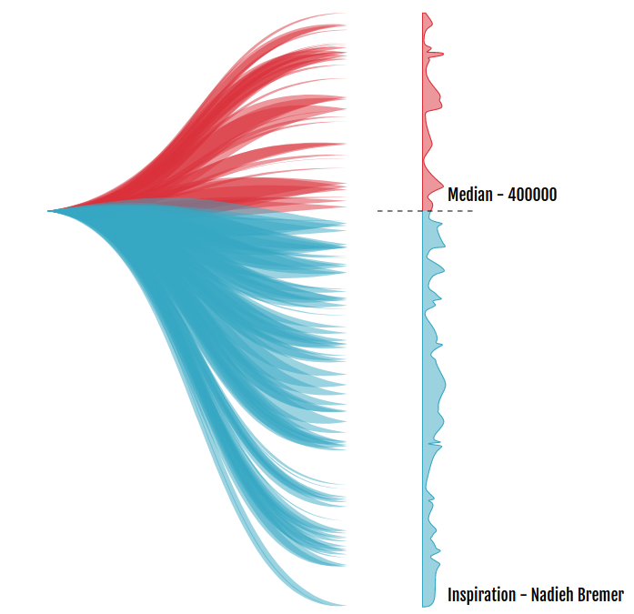

# This is a learning repossitory.
I've started to try my hand at data visualization. Here I'll be adding different visualization which I'll learn along the way.

## Chord diagram
This diagram shows total trade between different countries.

 between 2 countries")

## Threads diagram
This diagram shows the salary width i.e how much people earn a particular salary. The data is mocked up using [mockaroo](https://mockaroo.com/). The inspiration for this diagram is taken from Nadieh Bremer's [Bussed-out project](https://www.visualcinnamon.com/portfolio/bussed-out).

